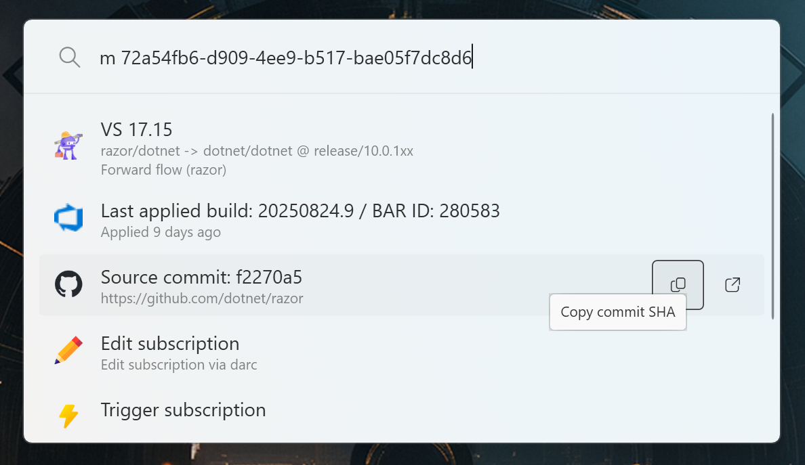

A plugin for [PowerToys Run](https://github.com/microsoft/PowerToys) that can quickly search/manage Maestro subscriptions.

  

## Usage

1. Press `Alt + Space` to open PowerToys Run.
2. Type `m ` to pick the plugin.
3. Insert GUID of a subscription you're after.

## Installation

- [Install PowerToys 0.93](https://github.com/microsoft/PowerToys/releases/tag/v0.93.0)
- `git clone https://github.com/premun/Community.PowerToys.Run.Plugin.Maestro`
- `cd Community.PowerToys.Run.Plugin.Maestro\Community.PowerToys.Run.Plugin.Maestro`
- `.\install-plugin.ps1`
